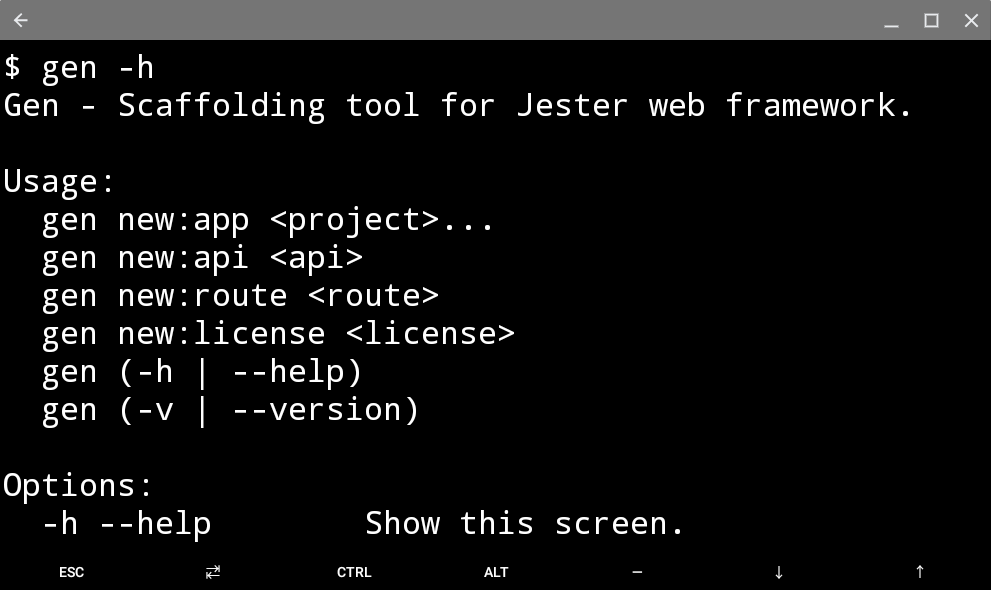

Generator 
----------------------------------------------

Scaffolding tool for Nim Lang's Jester web framework that is brain dead easy to use

Features
--------

 -   Get your app ready in no time.
 -   MVC architecture (Models, Views, Routes)
 -   Prebundled with a Dockerfile.
 -   Prebundled with a .nimble file
 -   Integrate quickly with PostgreSQL via norm.

Installation
------------

 ``$ nimble install gen``
               

Usage
-----

WIP
---
 - [x] Create jester sample route files
 - [x] Automatically install commonly used modules
 - [ ] Generate controllers
 - [ ] Generate models
 - [ ] Generate API

Contributions
-------------
 Still learning too, I would love any contribution and or suggestions which would make this project better.
 Feel free to fork this repo, create a pull request and it will be reviewed and merged!
