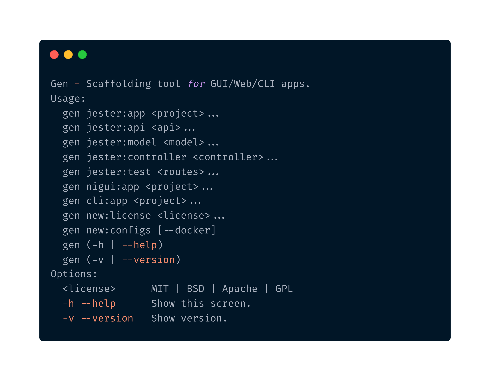

Generator 
----------------------------------------------
[](./LICENSE.txt)
[](https://travis-ci.org/Adeohluwa/gen)



Ultimate Scaffolding tool for GUI/Web/Cli written in Nim Lang that is brain dead easy to use


Features
--------

 -   Get your app ready in no time.
 -   Simple MVC architecture (Models, Views, Routes)
 -   Prebundled with a .nimble, .env, nim.cfg file 
 -   Integrate quickly with PostgreSQL via Norm.


Installation
------------

 ``
 $ nimble install gen
 ``
               


Usage
-----
```bash
  $ gen jester:app Uber
  $ cd Uber/
  $ gen new:license MIT
  $ gen new:configs
  $ ls 
  .
  |--- License.txt
  |--- README.md
  |--- app.nimble
  |--- bin/
  |     |--- app
  |--- nim.cfg
  |--- src/
  |     |--- app.nim
  |     |--- models/
  |     |--- public/
  |            |--- css/
  |            |--- img/
  |            |--- js/
  |     |--- routes/
  |     |--- views/
  |--- tests
  |--- .env
  |--- .gitignore
  |--- .travis.yml


```

WIP
---
 - [x] Create jester sample route files
 - [x] Automatically install commonly used modules
 - [x] Generate nim.cfg, .env, .gitignore config files 
 - [x] Generate MIT | Unilcense | Apache | Mozilla | GnuGPL3 license
 - [x] Generate Models
 - [ ] Generate Controllers
 - [ ] Generate API
 - [ ] Generate Tests
 - [ ] Scaffold GUI Apps
 - [ ] Scaffold CLI Apps

Contributions
-------------
 Appreciate all contributions and suggestions which would make this a more useful application for all Nim Lang users. Feel free to fork this repo, create a pull request and it will be reviewed and merged!